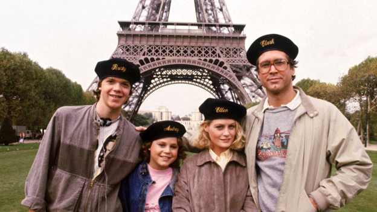

# Team 6 Final Capstone Project: European Vacation Hotel Recommender 

Presented by: Addis Ashenafi, Carlos Capado, Neil Ralston

[Link to Final Website](https://hotel-recommender-app.herokuapp.com/)

[Link to Final Project Report]()

  

## Executive Summary

After 26 weeks of Bootcamp, we are ready to travel abroad for some rest and relaxation!  A weekend trip to Europe sounds refreshing – but selecting a hotel seems daunting as there are so many to choose from!

Never fear, your cohorts on Team 6 have developed an application to help simplify the hotel selection process.  Using a Kaggle dataset containing over 500,000 customer reviews of nearly 1,500 luxury hotels across Europe, our application processes customer review comments to recommend other hotels with similar reviews.  

Dataset source:
https://www.kaggle.com/datasets/jiashenliu/515k-hotel-reviews-data-in-europe

The expected behavior from our application is that with a user-defined input – a target hotel name – similar hotels based on customer review comments will be returned.

Our application uses a Natural Language Processing (NLP) machine learning model to process customer review comments and determine similarity patterns within a content-based model.

The TF-IDF algorithm uses a relatively simple but intuitive approach to weighting words, making it a great starting point for our application.  

In our application, cosine similarity is used to measure the similarity of the TF-IDF scores of keywords derived from the hotel review comments.  

Our content filtering recommender model uses the TF-IDF scores and resulting cosine similarity calculations to determine which hotels have comparable review comments to a target selection.  
The cosine similarity matrix was saved as a NumPy array (.npy) in an AWS S3 bucket and accessed via s3fs, which provides a direct mapping of S3 to a local filesystem. 

As an example of the output provided by our model, if the Senator Hotel Vienna is the selected target, the hotel with the highest review similarity score (with a minimum user rating of 8.0) is the Guitart Grand Passage.

One of the most important aspects of data analysis is being able to tell a story through data visualizations. As such, we created several dashboards which assist us in telling a story for users trying to find the perfect hotel to stay at in Europe. 

In the first illustration, we can see all the hotels in Europe which have been rated. Through the filters, it is easy to parse out hotels by rating by average score.

Our website consists of six pages, as follows:

* Home page with introductory material and an interactive matrix to view hotels based on selected country, rating, and number of review filters.
* Hotel recommender search page where the user can input a target hotel name and see other hotels with similar review comments.
* Two pages of Tableau visualizations to provide context to the dataset.  The visualizations are interactive for the user to interrogate the data.
* An embedded copy of our final Project Report.
* Brief introductions about the project team.

Our application successfully delivers the intended result – a hotel recommender that returns results of hotels with similar review comments.  Our interactive visualizations provide additional context around the data, and our website pulls together the machine learning model and visuals into a stand-alone package.  

  
